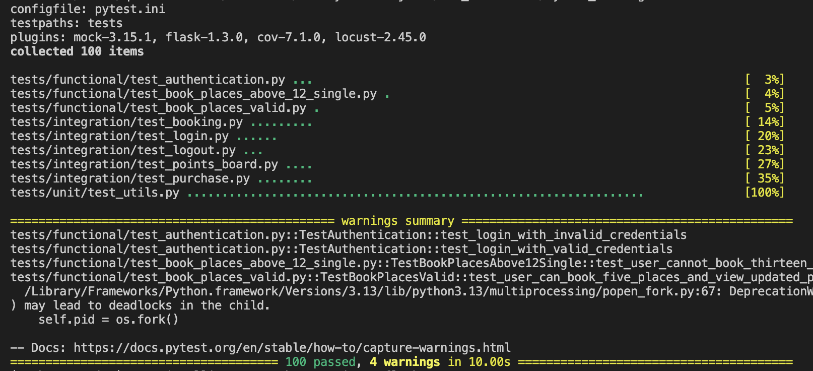
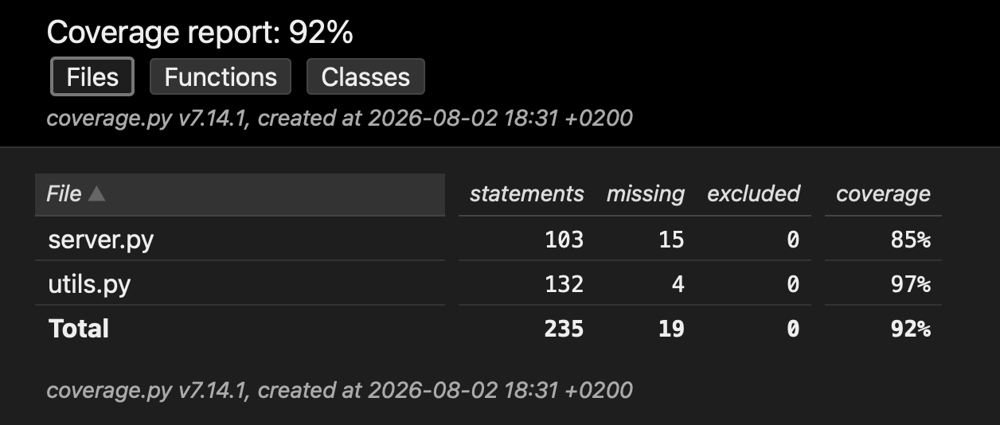
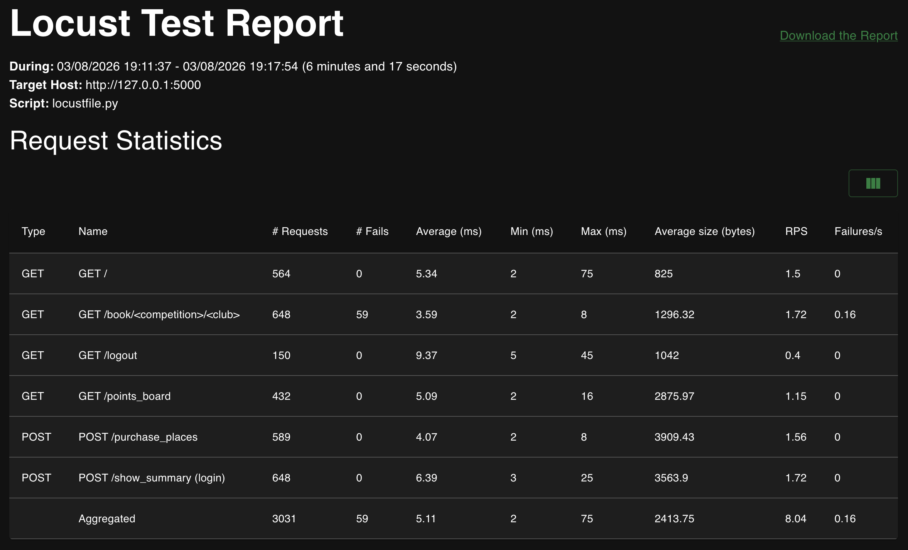
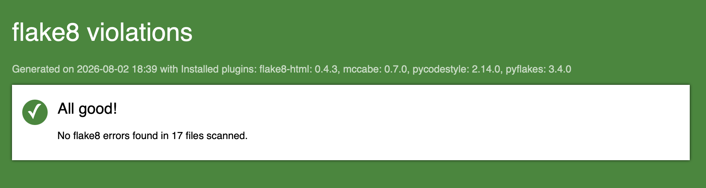

# GUDLFT Registration

## 📌 About

This is a **proof of concept (POC)** project for a lightweight competition booking platform. The goal is to keep things as simple as possible and iterate based on user feedback.

---

## ⚙️ Prerequisites

- **Python 3.10+** (recommended: 3.11 or 3.12)
- **pip** (Python package manager, included with Python 3)
- **Git** (for cloning the repository)

---

## 🚀 Getting Started

### 1️⃣ Clone the Repository

```bash
git clone https://github.com/Q1009/Python_Testing.git
cd Python_Testing
```

---

## 🛠️ Installation

### Create and Activate a Virtual Environment

A virtual environment isolates dependencies for this project, preventing conflicts with other Python projects on your system.

```bash
# Create a virtual environment in the project directory using virtualenv
virtualenv .

# Activate the virtual environment
# On macOS/Linux:
source bin/activate

# On Windows (Command Prompt):
Scripts\activate

# On Windows (PowerShell):
.\Scripts\activate
```

Your terminal prompt should now indicate the virtual environment is active.

> **⚠️ Note:** Always activate the virtual environment before running the app or tests.

---

### Install Dependencies

With the virtual environment active, install all required packages:

```bash
pip install --upgrade pip  # Optional: upgrade pip to the latest version
pip install -r requirements.txt
```

> **💡 Tip:** If you add a new package, update `requirements.txt` with:
> ```bash
> pip freeze > requirements.txt
> ```

---

## ▶️ Running the Application

Set the Flask environment variable and start the development server:

```bash
# On macOS/Linux:
export FLASK_APP=server.py
flask run

# On Windows (Command Prompt):
set FLASK_APP=server.py
flask run

# On Windows (PowerShell):
$env:FLASK_APP = "server.py"
flask run
```

The app should start on `http://127.0.0.1:5000/`. Open this address in your browser to access the **GUDLFT Registration Portal**.

---

## 📂 Project Structure

The application uses **JSON files** for data storage (no database required):

- `competitions.json` – List of available competitions
- `clubs.json` – List of clubs with their email and points

> **🔍 Tip:** Check these files to see valid login emails and available competitions.

---

## 🧪 Running Tests

This project includes **unit tests**, **integration tests**, and **functional tests**.

### Run All Tests

```bash
# Install pytest if not already installed
pip install pytest

# Run all tests
pytest
```
### 📊 Testing Results

Here are the pytest testing results of the current state of the project:




### Run Specific Test Suites

```bash
# Run only unit tests
pytest tests/unit/

# Run only integration tests
pytest tests/integration/

# Run only functional tests
pytest tests/functional/

# Run tests with verbose output
pytest -v
```

### Run Tests with Coverage

To check test coverage (how much of your code is tested):

```bash
# Install coverage if not already installed
pip install coverage

# Run tests with coverage and generate an HTML report
pytest --cov=. --cov-report html

#Open the report in your browser
open htmlcov/index.html  # macOS
start htmlcov/index.html   # Windows
xdg-open htmlcov/index.html # Linux

```

### 📊 Coverage Test Results

Here are the coverage results of the pytest tests in the current state of the project:



---

## 🚀 Performance Testing with Locust

[Locust](https://locust.io/) is used for **load testing** to simulate multiple users and check how the application performs under stress.

### Install Locust

```bash
# Install locust if not already installed
pip install locust
```

### Run Locust Tests

```bash
locust -f tests/performance/locustfile.py
```

### Using the Locust Web Interface

1. Open `http://localhost:8089` in your browser.
2. Set the **Number of total users** (e.g., 10).
3. Set the **Spawn rate** (users per second, e.g., 1).
4. Click **Start swarming**.
5. Monitor:
   - **Response times** (in ms)
   - **Request rate** (RPS)
   - **Failure rate**
   - **Number of users**

> **💡 Tip:** Stop the test with `Ctrl+C` in the terminal or click **Stop** in the web interface.

### 📊 Locust Performance Test Results

Here are the Locust performance results in the current state of the project with 10 users in total and a spawn rate of 1:



---

## 🔍 Code Quality & Linting

This project uses **Flake8** to ensure code compliance with [PEP 8](https://peps.python.org/pep-0008/) style guidelines.

### Generate an HTML Report

With the virtual environment active, to generate and visualize Flake8 results in a browser:

```bash
# Generate a detailed HTML report
flake8 --format=html --htmldir=flake8_report

# Open the report in your browser
open flake8_report/index.html  # macOS
start flake8_report/index.html   # Windows
xdg-open flake8_report/index.html # Linux
```

### 📊 Flake8 Report

Here are the Flake8 results of the current state of the project:



---

## 📝 Notes

- The virtual environment files (`bin/`, `Scripts/`, `lib/`, etc.) are **not committed** to Git (add them to `.gitignore`).
- Always **deactivate** the virtual environment when done:
  ```bash
  deactivate